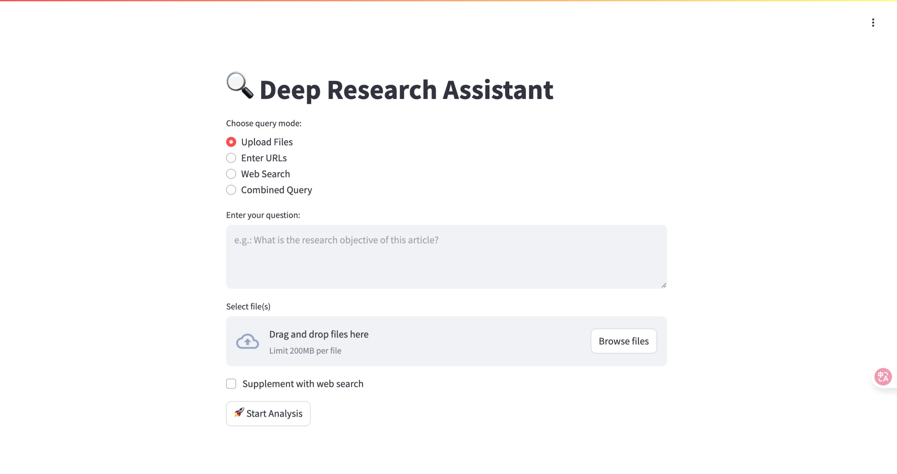

# 🔍 Deep Research Assistant

**Deep Research Assistant** is a full-featured toolkit designed to extract actionable insights from **local documents**, **web pages**, and **live internet searches** powered by Firecrawl. It combines [QAnything](https://github.com/netease-youdao/QAnything) for precise Retrieval-Augmented Generation (RAG), supports **hybrid workflows**, and offers a dual-language UI (Chinese and English) via Streamlit, CLI access, and a FastAPI backend.



## ✨ Key Features

| Component | Description |
|-----------|-------------|
| 🔎 **Smart Retrieval** | Uses QAnything for chunked ingestion, embeddings, and context-aware search |
| 🌐 **Hybrid Input** | Combine local PDFs, Markdown files, URLs, and live Firecrawl-powered web search |
| 🧠 **LLM Summarization** | Generates rich, structured reports using OpenAI's GPT models |
| 🌍 **Dual-language UI** | Chinese (`app.py`) and English (`app2.py`) Streamlit apps |
| ⚙️ **CLI + API** | Automate tasks using the CLI or integrate via FastAPI backend |


## 🛠 Installation Guide

### 1. Clone the Repository

```bash
git clone https://github.com/dahuilangda/deep-research-assistant.git
cd deep-research-assistant
```

### 2. Set Up Python Environment

```bash
python3 -m venv venv
source venv/bin/activate       # On macOS/Linux
# venv\Scripts\activate        # On Windows
```

### 3. Install Python Dependencies

```bash
pip install -r requirements.txt
```

### 4. Install QAnything

```bash
git clone https://github.com/netease-youdao/QAnything.git
cd QAnything
# Start on Linux
docker compose -f docker-compose-linux.yaml up
# Start on Mac
docker compose -f docker-compose-mac.yaml up
# Start on Windows
docker compose -f docker-compose-win.yaml up
```

### 5. Configure Environment Variables

```bash
cp env_example .env
# Then edit .env and set the following:
# BACKEND_HOST, BACKEND_PORT
# OPENAI_API_KEY, OPENAI_BASE_URL, OPENAI_MODEL_NAME
# QANYTHING_SERVER_URL, QANYTHING_USER_ID
# FIRECRAWL_API_URL, FIRECRAWL_API_KEY
# TMP_FILE_PATH (e.g., ./tmp)
# OUTPUT_LANG=en or zh
```


## 🚀 How to Run

### Start the Backend

```bash
python main.py
```

### Launch the Streamlit UI

* **Chinese UI**:

  ```bash
  streamlit run app.py
  ```

* **English UI** (make sure `OUTPUT_LANG=en`):

  ```bash
  streamlit run app2.py
  ```


## 🖥 CLI Usage

```bash
python cli.py "your query" [-f FILE] [-u URL] [-w]
```

| Option         | Description                                       |
| -------------- | ------------------------------------------------- |
| `-f FILE`      | Local file(s) (PDF or MD) to analyze              |
| `-u URL`       | Webpage URL(s) to scrape                          |
| `-w`           | Enable Firecrawl-powered web search               |
| `--chunk-size` | QAnything chunk size (default: 800)               |
| `--max-iter`   | Max search iterations (default: 3)                |
| `--max-chunks` | Max chunks to use for summarization (default: 20) |

#### Examples

```bash
python cli.py "Compare Milvus and Weaviate" \
  -f data/WhatisMilvus.pdf -u https://milvus.io/docs/overview.md -w
```


## 🧭 Web UI Workflow

1. Open the Streamlit app
2. Choose mode: Upload File / Enter URL / Web Search / Hybrid
3. Enter your query and upload or paste data sources
4. Click **Start Analysis**
5. View full structured report and references


## 🙏 Acknowledgements

Portions of the search and ingestion logic are adapted from [zilliztech/deep-searcher](https://github.com/zilliztech/deep-searcher). We appreciate their open-source contribution.