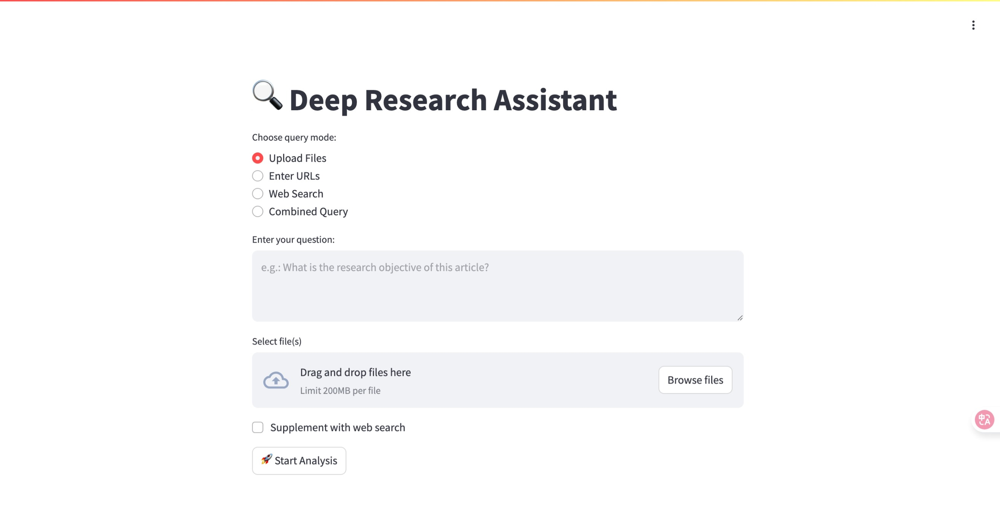

# 🔍 Deep Research Assistant

**Deep Research Assistant** 是一个功能强大的研究辅助工具，帮助您从**本地文档**、**网页内容**及**网络搜索**中提取可操作的洞察。它基于 QAnything 提供精确的检索增强生成（RAG）能力，结合 Firecrawl 实现即时网页爬取，并支持多数据源的混合分析。你可以通过中英文双语的 **Streamlit 前端界面**、**CLI 命令行工具** 和 **FastAPI 后端服务**灵活接入，轻松完成从数据摄取到报告生成的全流程。



## 🚀 核心特性

| 模块                 | 功能简介                                        |
| ------------------ | ------------------------------------------- |
| 🔎 **智能检索**        | 使用 QAnything 实现文档切分、嵌入上传、上下文感知的高精度检索        |
| 🌐 **混合数据源**       | 支持上传 PDF/Markdown、本地文件、网页链接及 Firecrawl 网络搜索 |
| 🧠 **智能摘要生成**      | 基于 OpenAI API 高质量生成行业报告、调研综述等               |
| 🌍 **双语前端 UI**     | 提供中文（`app.py`）与英文（`app2.py`）的 Streamlit 页面  |
| ⚙️ **命令行与 API 支持** | 使用 CLI 或 FastAPI 接口批量处理查询、自动化集成             |


## 🛠️ 快速上手

### 1. 克隆项目

```bash
git clone https://github.com/dahuilangda/deep-research-assistant.git
cd deep-research-assistant
```

### 2. 创建虚拟环境并安装依赖

```bash
python3 -m venv venv
source venv/bin/activate      # macOS/Linux
# venv\Scripts\activate       # Windows

pip install -r requirements.txt
```

### 3. 安装 QAnything

```bash
git clone https://github.com/netease-youdao/QAnything.git
cd QAnything
# Start on Linux
docker compose -f docker-compose-linux.yaml up
# Start on Mac
docker compose -f docker-compose-mac.yaml up
# Start on Windows
docker compose -f docker-compose-win.yaml up
```

### 4. 配置环境变量

```bash
cp env_example .env
# 修改 .env，填写以下内容：
# BACKEND_HOST, BACKEND_PORT
# OPENAI_API_KEY, OPENAI_MODEL_NAME, OPENAI_BASE_URL
# QANYTHING_SERVER_URL, QANYTHING_USER_ID
# FIRECRAWL_API_URL, FIRECRAWL_API_KEY
# TMP_FILE_PATH（如 ./tmp）
# OUTPUT_LANG=en 或 zh
```


## ▶️ 启动方式

### 后端 API

```bash
python main.py
```

### 前端 UI

* **中文界面**：

  ```bash
  streamlit run app.py
  ```

* **英文界面**（确保 `.env` 中设置 `OUTPUT_LANG=en`）：

  ```bash
  streamlit run app2.py
  ```


### 命令行 CLI

```bash
python cli.py "你的查询问题" [-f 文件] [-u URL] [-w] [其他选项]
```

#### CLI 参数说明：

| 参数             | 含义                       |
| -------------- | ------------------------ |
| `-f FILE`      | 指定本地文件（可多次使用）            |
| `-u URL`       | 指定网页链接（可多次使用）            |
| `-w`           | 启用 Firecrawl 网络搜索        |
| `--chunk-size` | QAnything 文档切分大小（默认：800） |
| `--max-iter`   | 最大检索迭代次数（默认：3）           |
| `--max-chunks` | 总结使用的最大文档块数（默认：20）       |


## 💡 示例用法

* **仅启用网络搜索**：

  ```bash
  python cli.py "最新 AI 芯片发展趋势有哪些？" -w
  ```

* **使用本地 PDF 查询**：

  ```bash
  python cli.py "总结 Milvus 的关键特性。" -f data/WhatisMilvus.pdf
  ```

* **结合文件与网页查询**：

  ```bash
  python cli.py "对比 Milvus 与 Weaviate。" -f data/WhatisMilvus.pdf -u https://milvus.io/docs/overview.md
  ```

* **同时使用 Firecrawl 与文件分析**：

  ```bash
  python cli.py "分析文档并找出最新案例。" -f data/WhatisMilvus.pdf -w
  ```


## 🧭 使用指南

1. 打开 Streamlit 页面（`app.py` 或 `app2.py`）
2. 选择模式：上传文件、输入网址、网络搜索或混合查询
3. 输入问题，上传文件或填写链接
4. 点击“开始分析”
5. 查看结构化报告和参考资料


## 🙏 鸣谢

本项目的部分搜索逻辑和代码借鉴自 [zilliztech/deep-searcher](https://github.com/zilliztech/deep-searcher)。感谢其开源贡献。